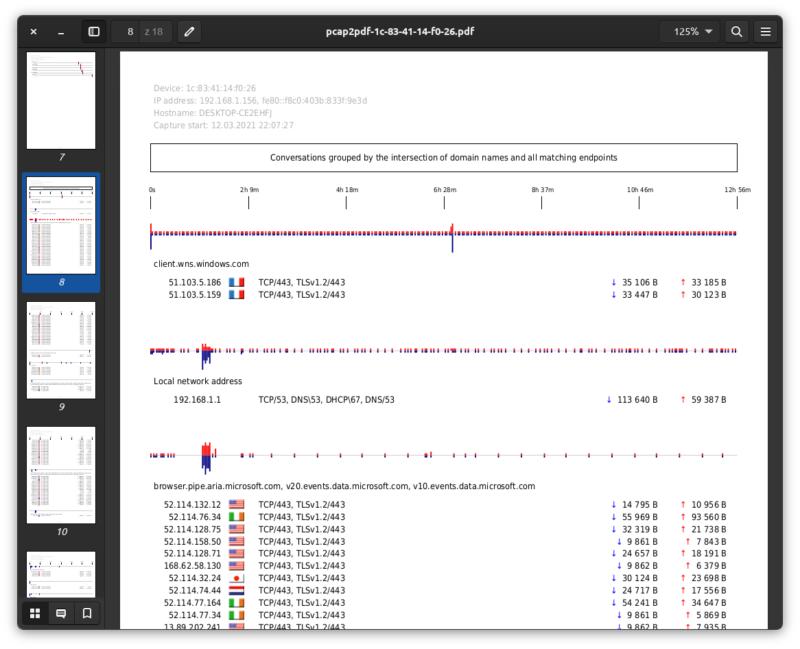

# pcap2pdf

Yet another way to visualize devices' network activity.

pcap2pdf creates PDF reports from a network capture (pcap/pcapng file).

<br>



-----

## Purpose

Know where and how often devices/apps are communicating while busy or idle.

See the difference between free and open source apps/operating systems and those from global life-style brands or unethical thieves selling peoples' personal data.

## Features

The first part of PDF contains communication to endpoints in chronological order (first contacted at the top).

The second part is aggregated (most frequent communication at the top).

When IP is clicked, it moves back and forth.

When domain name/flag is clicked, whois.com is opened with domain name/IP address.

## Samples

Download and see samples to have a better idea how the output looks like.

[This sample](./doc/sample-windows10.pdf) contains overnight network activity of idle, freshly installed Windows 10 laptop (without Microsoft online account).

[This sample](./doc/sample-macos11.pdf) was created with '--anonymize' option and contains overnight network activity of idle, freshly installed macOS 11 on MacBook Pro (without Apple ID provided).

The sample of my Debian laptop network activity is not provided since empty PDF wouldn't demonstrate the features well. (It is empty because my laptop doesn't keep open HTTPS socket to wait for commands from some mother company; doesn't send data to some surveillance company; doesn't download ads, news or stock prices as I did not told it to do so.)

-----

## Installation

### 1. Install dependencies

#### Debian GNU/Linux, Ubuntu

```
sudo apt update
sudo apt install python3 tshark fonts-dejavu-extra geoip-bin python3-pip python3-pil git

pip3 install fpdf
```

### 2. Install/update pcap2pdf

```
cd /tmp
git clone https://github.com/rozvara/pcap2pdf.git
cd pcap2pdf
source install.sh
```

## Usage

```
pcap2pdf /path/to/filename.pcap
```

For options use:
```
pcap2pdf -h
```

A PDF file will be created for every device (MAC address) found in the capture.

__All output files are saved in /tmp folder. Copy required ones somewhere else since /tmp folder is cleared on reboots.__

## Network traffic capturing

tcpdump, dumpcap, tshark, wireshark...

Or, you can made a wireless access point from an old laptop, connect and observe any device without hassle and generate PDFs directly on it. See [EduRouter](https://github.com/rozvara/EduRouter.git) project.
